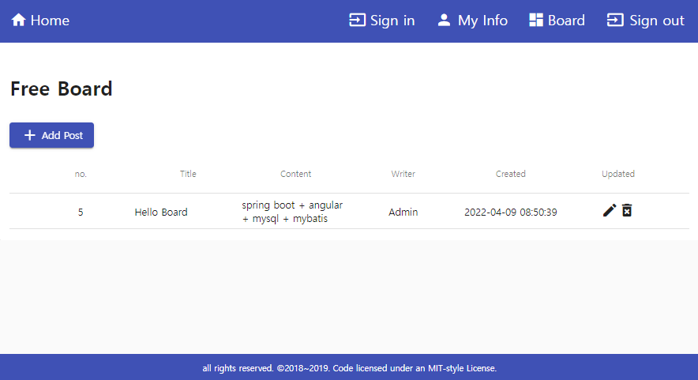

# Getting Started

The original source is brought from <https://daddyprogrammer.org/>. 

This repository has tuned source files that are built on gradle to maven and removed redundant dependencies of swagger and changed front UI to english.

springboot-angular-mysql-mybatis (The combination of spring boot + angular + mysql + mybatis).

As a reference, I remained the details of how to set up and load into Eclipse STS.

### 01. Eclipse STS > Maven > Update Project > Force Update of Snapshots/Releases

* Resolve the error; "The requested profile "pom.xml" could not be activated because it does not exist. "

### 02. Eclipse STS Lombok Configuration

* Install through official jar file. (very important)

```bash
java -jar lombok.jar
```
* Add an argument in SpringToolSuite4.ini 
 
```bash
 -vmargs -javaagent:lombok.jar
```

### 03. Run maven project manually (option)

```bash
mvn spring-boot:run
```

### 04. Static contents (Already built and configured)

Spring Boot will automatically add static web resources located within any of the following directories:

/META-INF/resources/  
/resources/  
/static/  
/public/

Install Angular Cli and dependencies

```bash
npm install -g @angular/cli
```

Unarchive `src/main/resources/app-src.zip` file.

Move onto the project directory, `src/main/resources/app-src/`, install dependencies by `npm install`, then `ng build`.

Copy files which are generated by `ng build` in `src/main/resources/app-src/dist/` directory to `src/main/resources/static/`

### 05. Spring Security (Configured)

To disable csrf and Spring Security Default Login page.

```java
@Configuration
@EnableWebSecurity
public class SecurityConfig extends WebSecurityConfigurerAdapter {
	
	@Override
    protected void configure(HttpSecurity http) throws Exception {
        http
                .authorizeRequests()
                .antMatchers("/**").permitAll()
                .and().cors().and().csrf().disable();
    }
}
```

### 06. Actuator (Configured)

application.properties

```bash
management.endpoints.web.base-path=/admin
management.server.port=9999
```

### 07. MySQL

Install Mysql whatever you are preferred. 

Execute `DDL.sql` file in `src/main/resources/mysql/`.

### 08. Browser

Access and try this code from `http://localhost:8080/`.



### Reference Documentation

For further reference, please consider the following sections:

* [Official Apache Maven documentation](https://maven.apache.org/guides/index.html)
* [Spring Boot Maven Plugin Reference Guide](https://docs.spring.io/spring-boot/docs/2.6.5/maven-plugin/reference/html/)
* [Create an OCI image](https://docs.spring.io/spring-boot/docs/2.6.5/maven-plugin/reference/html/#build-image)
* [MyBatis Framework](https://mybatis.org/spring-boot-starter/mybatis-spring-boot-autoconfigure/)
* [Spring Security](https://docs.spring.io/spring-boot/docs/2.6.5/reference/htmlsingle/#boot-features-security)
* [Spring Web](https://docs.spring.io/spring-boot/docs/2.6.5/reference/htmlsingle/#boot-features-developing-web-applications)

### Guides

The following guides illustrate how to use some features concretely:

* [Accessing data with MySQL](https://spring.io/guides/gs/accessing-data-mysql/)
* [MyBatis Quick Start](https://github.com/mybatis/spring-boot-starter/wiki/Quick-Start)
* [Securing a Web Application](https://spring.io/guides/gs/securing-web/)
* [Spring Boot and OAuth2](https://spring.io/guides/tutorials/spring-boot-oauth2/)
* [Authenticating a User with LDAP](https://spring.io/guides/gs/authenticating-ldap/)
* [Building a RESTful Web Service](https://spring.io/guides/gs/rest-service/)
* [Serving Web Content with Spring MVC](https://spring.io/guides/gs/serving-web-content/)
* [Building REST services with Spring](https://spring.io/guides/tutorials/bookmarks/)

